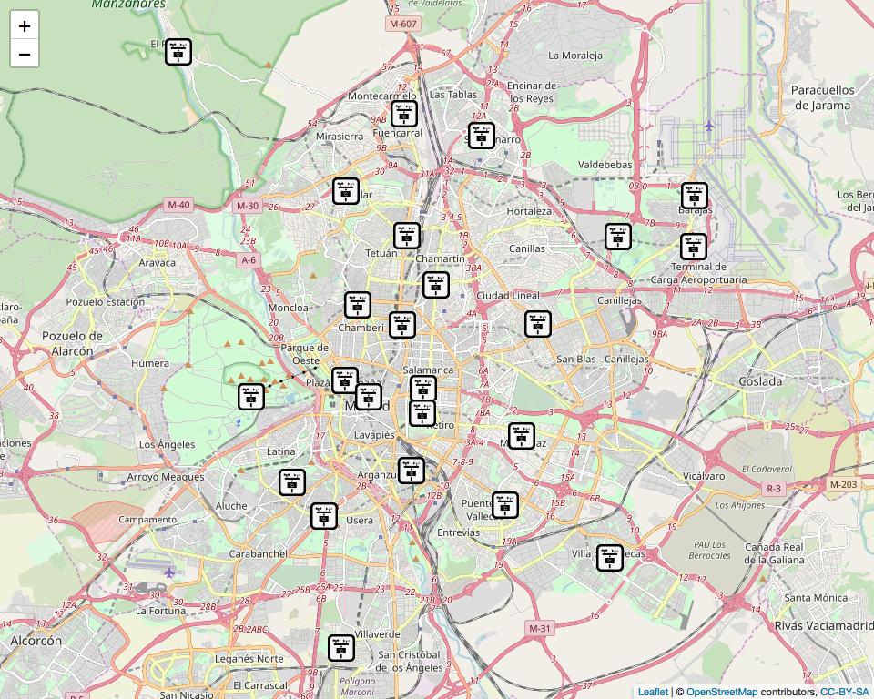

Madrid Pollution Report
================
Ashley O'Mahony | [ashleyomahony.com](http://ashleyomahony.com) | December 2018

------------------------------------------------------------------------

Dataset of the Pollution Level in Madrid
----------------------------------------

This report describes an analysis of the **pollution in Madrid between 2011 and 2016**.

The dataset consists in:

-   72 csv files containing hourly measures of pollutants across 24 stations,
-   1 xlsx file containing daily weather information.

The stations are located all across the city:



</br>

------------------------------------------------------------------------

Packages
--------

This analysis requires these R packages:

-   Data Cleaning: `readxl`, `tidyr`

-   Plotting: `ggplot2`, `corrplot`, `GGally`, `gridExtra`, `leaflet`

-   Statistics: `jtools`, `lattice`, `car`, `caret`, `MASS`

These packages are installed and loaded if necessary by the main script.

</br>

------------------------------------------------------------------------

Data Preparation
----------------

The pollution and weather data are first read from the input files, formatted, combined and aggregated, into the data frame *pollution\_daily\_h* which provides the averaged information per day.

The dataset contains information for 12 pollutants: **NO2, SO2, O3, PM2.5, BEN, CO, EBE, NMHC, NO, PM10, TCH, TOL**.

The workflow to prepare the data is as below:


</br>

Additional variables have been added:

-   *month*: the first day of the related month
-   *week*: the first day of the related week
-   *temp\_gap*: difference between temp\_min and temp\_max

The data frame *pollution\_daily\_h* is structured as below:

``` r
str(pollution_daily_h)
```

    ## 'data.frame':    2192 obs. of  22 variables:
    ##  $ date          : Date, format: "2011-01-01" "2011-01-02" ...
    ##  $ NO2           : num  41.5 48.5 63.6 46.3 51.5 ...
    ##  $ SO2           : num  10.71 11.93 11.91 8.84 9.51 ...
    ##  $ O3            : num  20.47 15.56 9.45 13.34 10.88 ...
    ##  $ PM2.5         : num  9.36 9.08 11.94 9.4 10.51 ...
    ##  $ BEN           : num  0.765 0.869 1.176 0.857 0.856 ...
    ##  $ CO            : num  0.372 0.453 0.532 0.367 0.395 ...
    ##  $ EBE           : num  0.595 0.722 1.047 0.788 1.074 ...
    ##  $ NMHC          : num  0.187 0.208 0.246 0.196 0.196 ...
    ##  $ NO            : num  16.5 28.8 71.1 27.8 36 ...
    ##  $ PM10          : num  13.8 13.7 21.6 14.4 15.6 ...
    ##  $ TCH           : num  1.43 1.62 1.62 1.46 1.52 ...
    ##  $ TOL           : num  1.66 2.14 3.56 2.4 3.19 ...
    ##  $ month         : Date, format: "2011-01-01" "2011-01-01" ...
    ##  $ week          : Date, format: "2010-12-27" "2010-12-27" ...
    ##  $ temp_avg      : num  8.3 8.6 4.2 6.5 8.9 12.2 10.9 9.8 8.4 6.9 ...
    ##  $ temp_max      : num  13 13 9.4 8 10 15 13 13 11 8.3 ...
    ##  $ temp_min      : num  3 4 -1.6 4.1 6.3 8.9 8.7 7.6 6.6 5.2 ...
    ##  $ precipitation : num  0 0 0 0 0 ...
    ##  $ humidity      : num  84 81 86 93 90 87 81 88 92 91 ...
    ##  $ wind_avg_speed: num  5.2 5.4 3.5 6.3 10.4 15.7 15.6 14.3 6.5 7.4 ...
    ##  $ temp_gap      : num  10 9 11 3.9 3.7 6.1 4.3 5.4 4.4 3.1 ...

``` r
summary(pollution_daily_h)
```

    ##       date                 NO2               SO2               O3         
    ##  Min.   :2011-01-01   Min.   :  7.819   Min.   : 1.679   Min.   :  3.979  
    ##  1st Qu.:2012-07-01   1st Qu.: 26.170   1st Qu.: 3.757   1st Qu.: 30.088  
    ##  Median :2013-12-31   Median : 35.646   Median : 5.483   Median : 49.555  
    ##  Mean   :2013-12-31   Mean   : 38.828   Mean   : 5.889   Mean   : 47.866  
    ##  3rd Qu.:2015-07-02   3rd Qu.: 48.122   3rd Qu.: 7.388   3rd Qu.: 65.058  
    ##  Max.   :2016-12-31   Max.   :105.077   Max.   :17.129   Max.   :110.287  
    ##      PM2.5             BEN               CO              EBE        
    ##  Min.   : 2.625   Min.   :0.1514   Min.   :0.1496   Min.   :0.1028  
    ##  1st Qu.: 7.306   1st Qu.:0.4520   1st Qu.:0.2575   1st Qu.:0.3318  
    ##  Median :10.024   Median :0.6152   Median :0.3075   Median :0.6782  
    ##  Mean   :11.112   Mean   :0.7392   Mean   :0.3574   Mean   :0.6789  
    ##  3rd Qu.:13.646   3rd Qu.:0.8911   3rd Qu.:0.4058   3rd Qu.:0.8651  
    ##  Max.   :58.556   Max.   :2.8132   Max.   :1.1792   Max.   :3.2252  
    ##       NMHC               NO               PM10              TCH       
    ##  Min.   :0.04319   Min.   :  2.351   Min.   :  3.618   Min.   :1.063  
    ##  1st Qu.:0.15269   1st Qu.:  6.973   1st Qu.: 12.730   1st Qu.:1.327  
    ##  Median :0.18694   Median : 11.814   Median : 18.556   Median :1.394  
    ##  Mean   :0.20500   Mean   : 23.681   Mean   : 20.805   Mean   :1.421  
    ##  3rd Qu.:0.23620   3rd Qu.: 26.178   3rd Qu.: 25.560   3rd Qu.:1.482  
    ##  Max.   :0.66167   Max.   :214.569   Max.   :216.628   Max.   :2.412  
    ##       TOL              month                 week           
    ##  Min.   : 0.2667   Min.   :2011-01-01   Min.   :2010-12-27  
    ##  1st Qu.: 1.6969   1st Qu.:2012-07-01   1st Qu.:2012-06-30  
    ##  Median : 2.4893   Median :2013-12-16   Median :2013-12-30  
    ##  Mean   : 3.0021   Mean   :2013-12-16   Mean   :2013-12-28  
    ##  3rd Qu.: 3.6722   3rd Qu.:2015-07-01   3rd Qu.:2015-06-29  
    ##  Max.   :15.6062   Max.   :2016-12-01   Max.   :2016-12-26  
    ##     temp_avg        temp_max        temp_min      precipitation    
    ##  Min.   :-0.50   Min.   : 3.30   Min.   :-7.000   Min.   : 0.0000  
    ##  1st Qu.: 8.40   1st Qu.:14.00   1st Qu.: 3.000   1st Qu.: 0.0000  
    ##  Median :14.60   Median :21.10   Median : 8.900   Median : 0.0000  
    ##  Mean   :15.45   Mean   :22.04   Mean   : 8.755   Mean   : 0.9173  
    ##  3rd Qu.:22.70   3rd Qu.:30.10   3rd Qu.:14.600   3rd Qu.: 0.0000  
    ##  Max.   :32.30   Max.   :42.00   Max.   :25.800   Max.   :48.0100  
    ##     humidity     wind_avg_speed     temp_gap    
    ##  Min.   :15.00   Min.   : 2.00   Min.   : 2.10  
    ##  1st Qu.:36.00   1st Qu.: 6.30   1st Qu.: 9.50  
    ##  Median :55.00   Median : 8.70   Median :14.10  
    ##  Mean   :55.04   Mean   :10.15   Mean   :13.29  
    ##  3rd Qu.:73.00   3rd Qu.:12.60   3rd Qu.:17.00  
    ##  Max.   :99.00   Max.   :35.60   Max.   :24.50

The data frame doesn't contain any `NA` across its 2192 observations and 22 variables.

</br>

------------------------------------------------------------------------

Evolution of the Variables Over Time
------------------------------------

The charts below describe the evolution of each variable over time.


*Dark Orange = Main Pollutants | Light Orange = Other Pollutants | Blue = Weather Parameters*

</br>

Seasonal cycles suggests that the weather has an influence on the level of some pollutants.

</br>

------------------------------------------------------------------------

Correlation Matrix
------------------

A correlation matrix is plotted to identify correlations between the variables:


</br>

Another view provides more information: 

</br>

------------------------------------------------------------------------

NO2 Model
---------

A linear regression will be used to model the level of pollution in NO2. The data is split in train and test sets with the ratio 80|20.

``` r
set.seed(2018)
train.size <- 0.8
train.index <- sample.int(length(pollution_daily_h$NO2), round(length(pollution_daily_h$NO2) * train.size))
train.sample <- pollution_daily_h[train.index,]
test.sample <- pollution_daily_h[-train.index,]
```

The Train set has 1754 rows and the Test set has 438 rows.

`temp_min` and `temp_max` are removed as correlated by definition with `temp_avg`. But the variable `temp_gap` is created to measure their influence on the model.

``` r
multi_model_NO2<-lm(NO2~.-month-week-date-temp_min-temp_max, data=train.sample)
lm_stats <- summary(multi_model_NO2)
print(lm_stats)
```

    ## 
    ## Call:
    ## lm(formula = NO2 ~ . - month - week - date - temp_min - temp_max, 
    ##     data = train.sample)
    ## 
    ## Residuals:
    ##      Min       1Q   Median       3Q      Max 
    ## -21.9368  -3.1235   0.0047   3.2157  21.3306 
    ## 
    ## Coefficients:
    ##                 Estimate Std. Error t value Pr(>|t|)    
    ## (Intercept)     1.229319   3.113391   0.395 0.693003    
    ## SO2             1.383111   0.077489  17.849  < 2e-16 ***
    ## O3             -0.149220   0.012032 -12.402  < 2e-16 ***
    ## PM2.5           0.255679   0.067646   3.780 0.000162 ***
    ## BEN             3.343452   1.165812   2.868 0.004182 ** 
    ## CO             45.100966   3.957109  11.397  < 2e-16 ***
    ## EBE             2.843966   0.553288   5.140 3.06e-07 ***
    ## NMHC            1.358368   1.981506   0.686 0.493105    
    ## NO             -0.201584   0.017344 -11.623  < 2e-16 ***
    ## PM10           -0.008354   0.024343  -0.343 0.731516    
    ## TCH            11.070151   1.621469   6.827 1.19e-11 ***
    ## TOL             2.850827   0.214695  13.279  < 2e-16 ***
    ## temp_avg       -0.122812   0.038525  -3.188 0.001459 ** 
    ## precipitation   0.178564   0.041030   4.352 1.43e-05 ***
    ## humidity       -0.098214   0.015546  -6.318 3.36e-10 ***
    ## wind_avg_speed -0.323058   0.032912  -9.816  < 2e-16 ***
    ## temp_gap        0.304426   0.053019   5.742 1.10e-08 ***
    ## ---
    ## Signif. codes:  0 '***' 0.001 '**' 0.01 '*' 0.05 '.' 0.1 ' ' 1
    ## 
    ## Residual standard error: 5.096 on 1737 degrees of freedom
    ## Multiple R-squared:  0.9113, Adjusted R-squared:  0.9105 
    ## F-statistic:  1116 on 16 and 1737 DF,  p-value: < 2.2e-16

</br>

The R-square of the model is 0.9113 and the Adjusted R-squared is 0.9105, which means that the model is able to well explain NO2. Precisely, the predictors explain 91.1% of the variability in NO2.

The *Mean Squared Error* measures the mean of all of our errors squared. It describes the accuracy of a model. The MSE of this model is 5.0962.

Another way to evaluate a model is looking at the *confidence intervals* of the coefficients. The estimates for each coefficient are not exact, so the confidence intervals define a range in which the actual values are, at a certain level of confidence:

*For every change of one (1) unit in the SO2 level, one can be 95% confident that the level of NO2 will change between 1.23 and 1.54.*

The confidence intervals can be plotted:


</br>

The *residuals* of the model can be checked using these plots:

``` r
resids_multi_NO2 <- multi_model_NO2$residuals
```


The residuals seem correct and validate the model. Significant variables can be found using a *stepwise regression*.

    ## Start:  AIC=5729.65
    ## NO2 ~ (date + SO2 + O3 + PM2.5 + BEN + CO + EBE + NMHC + NO + 
    ##     PM10 + TCH + TOL + month + week + temp_avg + temp_max + temp_min + 
    ##     precipitation + humidity + wind_avg_speed + temp_gap) - month - 
    ##     week - date - temp_min - temp_max
    ## 
    ##                  Df Sum of Sq   RSS    AIC
    ## - PM10            1       3.1 45114 5727.8
    ## - NMHC            1      12.2 45124 5728.1
    ## <none>                        45111 5729.7
    ## - BEN             1     213.6 45325 5735.9
    ## - temp_avg        1     263.9 45375 5737.9
    ## - PM2.5           1     371.0 45482 5742.0
    ## - precipitation   1     491.9 45603 5746.7
    ## - EBE             1     686.2 45798 5754.1
    ## - temp_gap        1     856.2 45968 5760.6
    ## - humidity        1    1036.6 46148 5767.5
    ## - TCH             1    1210.5 46322 5774.1
    ## - wind_avg_speed  1    2502.4 47614 5822.3
    ## - CO              1    3373.7 48485 5854.2
    ## - NO              1    3508.4 48620 5859.0
    ## - O3              1    3994.5 49106 5876.5
    ## - TOL             1    4579.1 49691 5897.2
    ## - SO2             1    8274.0 53385 6023.0
    ## 
    ## Step:  AIC=5727.77
    ## NO2 ~ SO2 + O3 + PM2.5 + BEN + CO + EBE + NMHC + NO + TCH + TOL + 
    ##     temp_avg + precipitation + humidity + wind_avg_speed + temp_gap
    ## 
    ##                  Df Sum of Sq   RSS    AIC
    ## - NMHC            1      11.8 45126 5726.2
    ## <none>                        45114 5727.8
    ## + PM10            1       3.1 45111 5729.7
    ## - BEN             1     226.7 45341 5734.6
    ## - temp_avg        1     268.4 45383 5736.2
    ## - precipitation   1     489.2 45604 5744.7
    ## - EBE             1     684.2 45799 5752.2
    ## - temp_gap        1     860.1 45974 5758.9
    ## - PM2.5           1    1026.3 46141 5765.2
    ## - humidity        1    1067.1 46181 5766.8
    ## - TCH             1    1212.3 46327 5772.3
    ## - wind_avg_speed  1    2579.1 47693 5823.3
    ## - CO              1    3375.5 48490 5852.3
    ## - NO              1    3519.4 48634 5857.5
    ## - O3              1    4095.4 49210 5878.2
    ## - TOL             1    4582.1 49697 5895.4
    ## - SO2             1    8271.4 53386 6021.0
    ## 
    ## Step:  AIC=5726.23
    ## NO2 ~ SO2 + O3 + PM2.5 + BEN + CO + EBE + NO + TCH + TOL + temp_avg + 
    ##     precipitation + humidity + wind_avg_speed + temp_gap
    ## 
    ##                  Df Sum of Sq   RSS    AIC
    ## <none>                        45126 5726.2
    ## + NMHC            1      11.8 45114 5727.8
    ## + PM10            1       2.6 45124 5728.1
    ## - BEN             1     219.7 45346 5732.7
    ## - temp_avg        1     285.4 45412 5735.3
    ## - precipitation   1     493.7 45620 5743.3
    ## - EBE             1     674.1 45800 5750.2
    ## - temp_gap        1     863.8 45990 5757.5
    ## - PM2.5           1    1015.2 46141 5763.2
    ## - humidity        1    1089.1 46215 5766.1
    ## - TCH             1    2061.8 47188 5802.6
    ## - wind_avg_speed  1    2568.7 47695 5821.3
    ## - NO              1    3616.4 48743 5859.4
    ## - CO              1    3638.7 48765 5860.2
    ## - O3              1    4133.0 49259 5877.9
    ## - TOL             1    4701.8 49828 5898.1
    ## - SO2             1    8611.7 53738 6030.6

    ## Stepwise Model Path 
    ## Analysis of Deviance Table
    ## 
    ## Initial Model:
    ## NO2 ~ (date + SO2 + O3 + PM2.5 + BEN + CO + EBE + NMHC + NO + 
    ##     PM10 + TCH + TOL + month + week + temp_avg + temp_max + temp_min + 
    ##     precipitation + humidity + wind_avg_speed + temp_gap) - month - 
    ##     week - date - temp_min - temp_max
    ## 
    ## Final Model:
    ## NO2 ~ SO2 + O3 + PM2.5 + BEN + CO + EBE + NO + TCH + TOL + temp_avg + 
    ##     precipitation + humidity + wind_avg_speed + temp_gap
    ## 
    ## 
    ##     Step Df  Deviance Resid. Df Resid. Dev      AIC
    ## 1                          1737   45111.36 5729.651
    ## 2 - PM10  1  3.058383      1738   45114.42 5727.770
    ## 3 - NMHC  1 11.762300      1739   45126.18 5726.227

</br>

These results indicate that the variables `PM10` and `NMHC` can be removed. The resulting model is:

    ## 
    ## Call:
    ## lm(formula = NO2 ~ . - month - week - date - temp_min - temp_max - 
    ##     PM10 - NMHC, data = train.sample)
    ## 
    ## Residuals:
    ##      Min       1Q   Median       3Q      Max 
    ## -22.0494  -3.1185   0.0019   3.2071  21.4585 
    ## 
    ## Coefficients:
    ##                Estimate Std. Error t value Pr(>|t|)    
    ## (Intercept)     0.45196    2.92446   0.155  0.87720    
    ## SO2             1.36999    0.07520  18.217  < 2e-16 ***
    ## O3             -0.14716    0.01166 -12.620  < 2e-16 ***
    ## PM2.5           0.23432    0.03746   6.255 5.00e-10 ***
    ## BEN             3.33921    1.14768   2.910  0.00367 ** 
    ## CO             45.69600    3.85895  11.842  < 2e-16 ***
    ## EBE             2.79371    0.54813   5.097 3.83e-07 ***
    ## NO             -0.20239    0.01714 -11.805  < 2e-16 ***
    ## TCH            11.71564    1.31433   8.914  < 2e-16 ***
    ## TOL             2.86320    0.21271  13.461  < 2e-16 ***
    ## temp_avg       -0.12662    0.03818  -3.317  0.00093 ***
    ## precipitation   0.17861    0.04095   4.362 1.37e-05 ***
    ## humidity       -0.09773    0.01509  -6.478 1.20e-10 ***
    ## wind_avg_speed -0.32267    0.03243  -9.949  < 2e-16 ***
    ## temp_gap        0.30558    0.05297   5.769 9.40e-09 ***
    ## ---
    ## Signif. codes:  0 '***' 0.001 '**' 0.01 '*' 0.05 '.' 0.1 ' ' 1
    ## 
    ## Residual standard error: 5.094 on 1739 degrees of freedom
    ## Multiple R-squared:  0.9113, Adjusted R-squared:  0.9106 
    ## F-statistic:  1276 on 14 and 1739 DF,  p-value: < 2.2e-16

The R-squared value of 0.9113 is consistent with the initial model.

*Multicollinearity* can be treated with the *VIF Method* (Variance Inflation Factors). As a general rule, if the VIF value is larger than 5, the multicollinearity is assumed to be high.

For each variable of the model:

-   the VIF values are calculated,
-   the variable with the largest value is removed,
-   the model is re-run the explanatory variables having a VIF value below 5.

The current VIF values are:

    ##            SO2             O3          PM2.5            BEN             CO 
    ##       2.731960       4.737638       2.589103      15.175970      21.433198 
    ##            EBE             NO            TCH            TOL       temp_avg 
    ##       3.384605      15.882579       2.124477      11.084651       6.505867 
    ##  precipitation       humidity wind_avg_speed       temp_gap 
    ##       1.218099       6.663257       1.991433       4.170651

The VIF values resulting from the procedure are:

    ##            SO2             O3          PM2.5            EBE            TCH 
    ##       1.958788       3.351606       2.049109       1.829030       1.781684 
    ##       temp_avg  precipitation wind_avg_speed       temp_gap 
    ##       3.056575       1.154820       1.743077       2.058636

</br>

After removing multicollinear variables, the **Final Model** is:

    ## NO2 ~ SO2 + O3 + PM2.5 + EBE + TCH + temp_avg + precipitation + 
    ##     wind_avg_speed + temp_gap

    ## 
    ## Call:
    ## lm(formula = NO2 ~ SO2 + O3 + PM2.5 + EBE + TCH + temp_avg + 
    ##     precipitation + wind_avg_speed + temp_gap, data = train.sample)
    ## 
    ## Residuals:
    ##      Min       1Q   Median       3Q      Max 
    ## -21.9354  -4.1242   0.1759   3.9862  18.8808 
    ## 
    ## Coefficients:
    ##                Estimate Std. Error t value Pr(>|t|)    
    ## (Intercept)    -1.34165    2.32129  -0.578   0.5634    
    ## SO2             1.70825    0.07619  22.421  < 2e-16 ***
    ## O3             -0.23205    0.01174 -19.774  < 2e-16 ***
    ## PM2.5           0.56677    0.03988  14.213  < 2e-16 ***
    ## EBE             8.34368    0.48211  17.307  < 2e-16 ***
    ## TCH            17.17983    1.44013  11.929  < 2e-16 ***
    ## temp_avg       -0.13117    0.03131  -4.189 2.94e-05 ***
    ## precipitation   0.14279    0.04770   2.993   0.0028 ** 
    ## wind_avg_speed -0.35111    0.03630  -9.672  < 2e-16 ***
    ## temp_gap        0.77269    0.04452  17.355  < 2e-16 ***
    ## ---
    ## Signif. codes:  0 '***' 0.001 '**' 0.01 '*' 0.05 '.' 0.1 ' ' 1
    ## 
    ## Residual standard error: 6.095 on 1744 degrees of freedom
    ## Multiple R-squared:  0.8727, Adjusted R-squared:  0.872 
    ## F-statistic:  1328 on 9 and 1744 DF,  p-value: < 2.2e-16

</br>

A *10-Fold Cross Validation* can confirm the accuracy of the models:

    ## [1] "Initial Model:"

    ## Linear Regression 
    ## 
    ## 1754 samples
    ##   21 predictor
    ## 
    ## Pre-processing: centered (16), scaled (16) 
    ## Resampling: Cross-Validated (10 fold) 
    ## Summary of sample sizes: 1578, 1579, 1579, 1579, 1578, 1579, ... 
    ## Resampling results:
    ## 
    ##   RMSE     Rsquared   MAE    
    ##   5.13777  0.9079525  3.97799
    ## 
    ## Tuning parameter 'intercept' was held constant at a value of TRUE

    ## [1] "Final Model:"

    ## Linear Regression 
    ## 
    ## 1754 samples
    ##    9 predictor
    ## 
    ## Pre-processing: centered (9), scaled (9) 
    ## Resampling: Cross-Validated (10 fold) 
    ## Summary of sample sizes: 1578, 1578, 1579, 1579, 1578, 1578, ... 
    ## Resampling results:
    ## 
    ##   RMSE      Rsquared   MAE     
    ##   6.112716  0.8716267  4.866125
    ## 
    ## Tuning parameter 'intercept' was held constant at a value of TRUE

</br>

The predictions of both models can be compared.

``` r
test.sample$NO2_predicted_model_final <- predict(multi_model_NO2_final,test.sample)
test.sample$NO2_predicted_model_0 <- predict(multi_model_NO2_0,test.sample)
```

Depending on the prediction point, the final model can be better or worse than the initial model. Below table displays some examples of the prediction points (predictions rows 80-90):

    ##          NO2 NO2_predicted_model_0 NO2_predicted_model_final
    ## 428 32.90278              33.47543                  38.52169
    ## 436 41.62434              45.47223                  48.86567
    ## 438 66.43728              62.02274                  58.57356
    ## 441 37.94618              36.13524                  35.07174
    ## 443 20.01215              21.83412                  21.85867
    ## 447 58.33043              54.81361                  52.00605
    ## 464 35.96528              37.69067                  40.09754
    ## 470 18.65799              15.89007                  17.62860
    ## 482 28.10417              21.46581                  22.55336
    ## 489 45.54340              37.47732                  37.65892
    ## 490 31.50521              22.42451                  23.59314

</br>

The accuracy of each prediction point can be understood by comparing their values with the actual values:


*Blue = Initial Model | Orange = Final Model*

</br>

The models predictions can be compared statistically using an *One-Way Analysis of Variance* (ANOVA) and a plot of the coefficients confidence intervals:

    ## Analysis of Variance Table
    ## 
    ## Model 1: NO2 ~ (date + SO2 + O3 + PM2.5 + BEN + CO + EBE + NMHC + NO + 
    ##     PM10 + TCH + TOL + month + week + temp_avg + temp_max + temp_min + 
    ##     precipitation + humidity + wind_avg_speed + temp_gap) - month - 
    ##     week - date - temp_min - temp_max - PM10 - NMHC
    ## Model 2: NO2 ~ SO2 + O3 + PM2.5 + EBE + TCH + temp_avg + precipitation + 
    ##     wind_avg_speed + temp_gap
    ##   Res.Df   RSS Df Sum of Sq      F    Pr(>F)    
    ## 1   1739 45126                                  
    ## 2   1744 64788 -5    -19661 151.54 < 2.2e-16 ***
    ## ---
    ## Signif. codes:  0 '***' 0.001 '**' 0.01 '*' 0.05 '.' 0.1 ' ' 1


The low *p-value* returned by the ANOVA indicates that the Final model is significantly better than the Initial Model. The plot gives an indication on how each variable influences the predictions, with a 95% confidence interval.

As a conclusion, the Final Model provides a good way to predict the NO2 pollution level based on 9 pollutants and 5 weather parameters.

</br>

------------------------------------------------------------------------

###### *Ashley O'Mahony | [ashleyomahony.com](http://ashleyomahony.com) | December 2018*

------------------------------------------------------------------------
